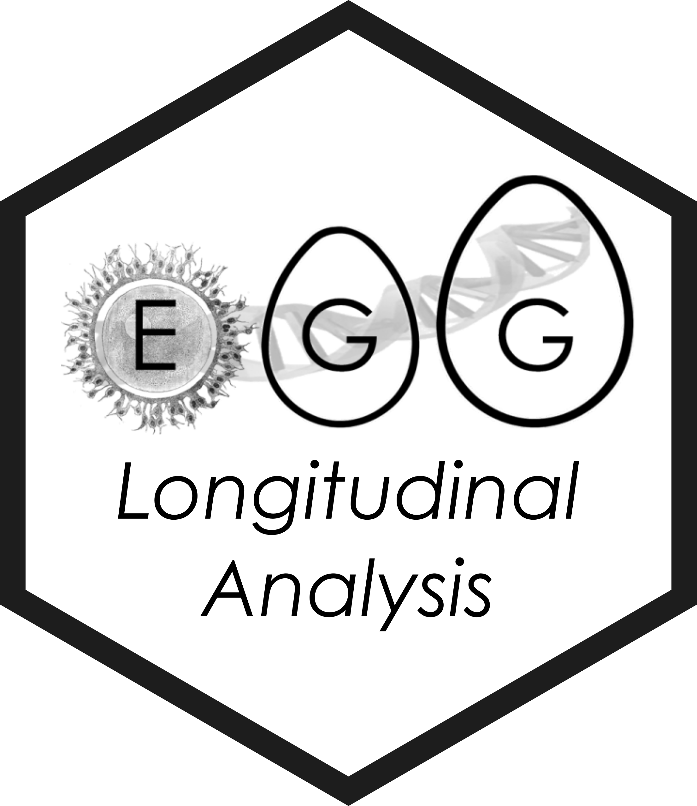

<!-- README.md is generated from README.Rmd. Please edit that file -->

```{r, include = FALSE}
knitr::opts_chunk$set(
  collapse = TRUE,
  comment = "#>"
)
```

# EGG Longitudinal Analysis 

<!-- badges: start -->
[](https://www.tidyverse.org/lifecycle/#experimental)
[](https://github.com/mcanouil/eggla)
[](https://codecov.io/gh/mcanouil/eggla)
[](https://github.com/mcanouil/eggla/actions/workflows/check-pak.yml)
[](https://github.com/mcanouil/eggla/actions/workflows/build-docker.yml)
<!-- badges: end -->

Tools for longitudinal analysis within the [EGG (Early Growth Genetics) Consortium](http://egg-consortium.org/).

## Installation

* Install the development version from GitHub:

```{r, eval = FALSE}
# install.packages("remotes")
remotes::install_github("mcanouil/eggla")
```

* Install a particular version:

```{r, eval = FALSE}
# install.packages("remotes")
remotes::install_github("mcanouil/eggla@v0.10.4")
```

## Docker Images

- `docker pull ghcr.io/mcanouil/eggla:devel`.
- `docker pull ghcr.io/mcanouil/eggla:latest`.

## License

MIT © [Mickaël Canouil](https://mickael.canouil.fr/), Nicole Warrington, Kimberley Burrows, and Anni Heiskala.

## Code of Conduct

Please note that the `eggla` project is released with a [Contributor Code of Conduct](https://contributor-covenant.org/version/2/0/CODE_OF_CONDUCT.html).  
By contributing to this project, you agree to abide by its terms.
