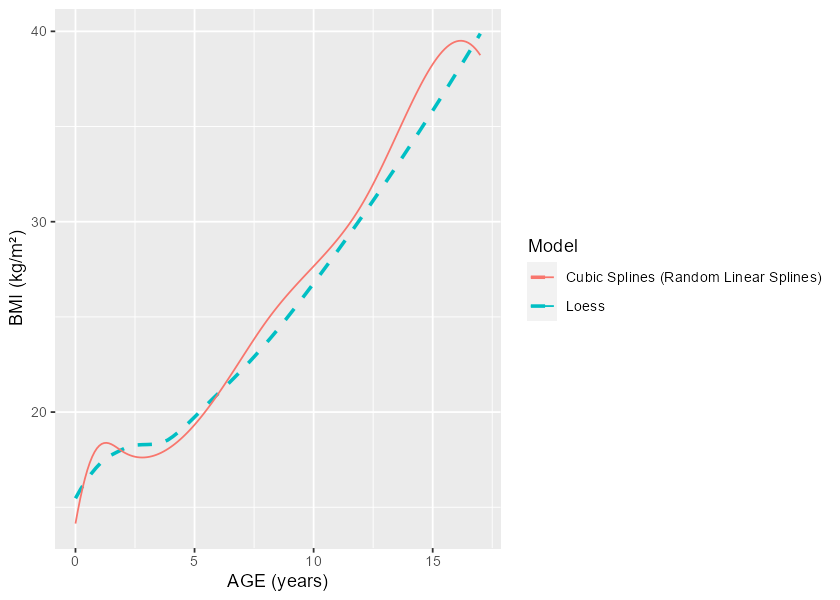
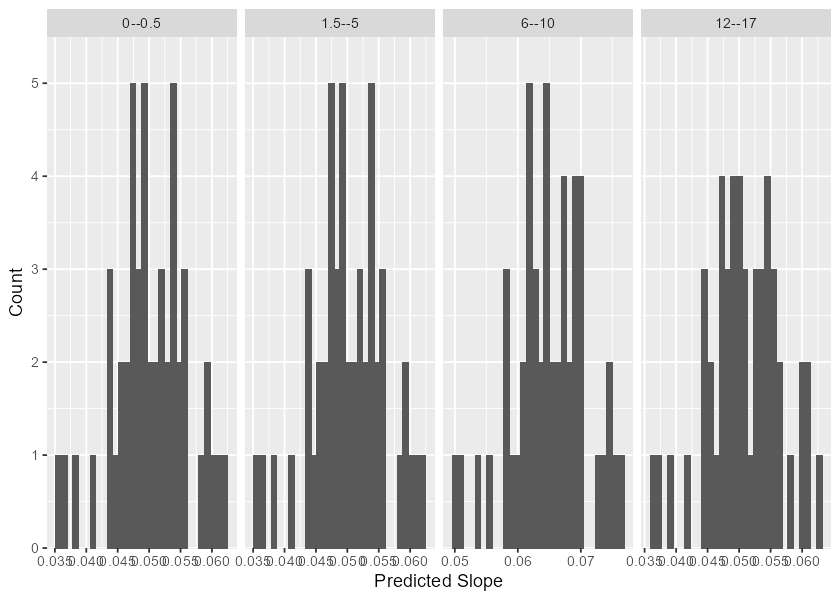
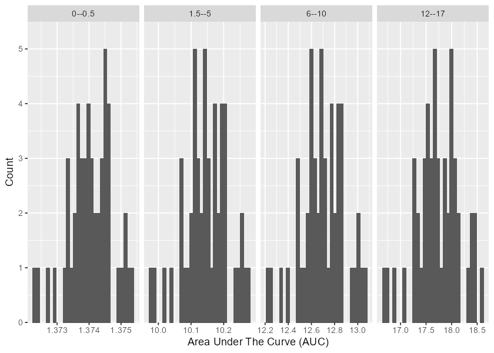

<!-- README.md is generated from README.Rmd. Please edit that file -->

# Early Growth Genetics Longitudinal Analysis 

<!-- badges: start -->

[](https://www.tidyverse.org/lifecycle/#experimental)
[](https://github.com/mcanouil/eggla)
[](https://CRAN.R-project.org/package=eggla)
[](https://github.com/mcanouil/eggla/actions)
[](https://github.com/mcanouil/eggla/actions)
<!-- badges: end -->

Tools for longitudinal analysis within the EGG (Early Growth Genetics)
Consortium.

## Installation

``` r
# Install the development version from GitHub:
# install.packages("remotes")
remotes::install_github("mcanouil/eggla")

# Or a particular version:
remotes::install_github("mcanouil/eggla@v0.3.0")
```

## Hands on **eggla**

``` r
library(eggla)
library(data.table)
#> data.table 1.14.0 using 2 threads (see ?getDTthreads).  Latest news: r-datatable.com
library(ggplot2)
library(patchwork)
library(broom.mixed)
#> Warning: package 'broom.mixed' was built under R version 4.1.1
```

### Data

**eggla** includes a small dataset with 1050 rows and 6 variables.

-   `ID` (`character`): ID using three digits.
-   `age` (`numeric`): age in years.
-   `sex` (`integer`): sex with 1: male and 0: female.
-   `weight` (`numeric`): weight in kilograms.
-   `height` (`integer`): height in centimetres.
-   `bmi` (`numeric`): Body Mass Index in kilograms per quare metre.

``` r
data("bmigrowth")
bmigrowth <- as.data.table(bmigrowth)
bmigrowth[bmigrowth[["ID"]] == "001"]
#>     ID   age sex    weight height      bmi
#> 1: 001  0.00   0  3.318845     47 15.02420
#> 2: 001  0.25   0  6.585227     60 18.29230
#> 3: 001  0.50   0  7.239751     64 17.67517
#> 4: 001  0.75   0  9.474914     66 21.75141
#> 5: 001  2.00   0 13.990333     79 22.41681
#> 6: 001  4.00   0 25.909311    105 23.50051
#> 7: 001  6.00   0 30.117745    106 26.80469
#> 8: 001 12.00   0 77.958539    148 35.59101
#> 9: 001 14.00   0 92.021767    156 37.81302
```

``` r
ggplot(data = bmigrowth, mapping = aes(x = age, y = bmi, colour = factor(ID))) +
  geom_path(na.rm = TRUE, alpha = 0.25) +
  geom_point(size = 0.5, na.rm = TRUE, alpha = 0.25) +
  stat_smooth(method = "loess", formula = y ~ x, linetype = 1, colour = "firebrick", se = FALSE) +
  theme(legend.position = "none") +
  labs(x = "AGE (years)", y = "BMI (kg/m²)") +
  facet_grid(
    cols = vars(sex),
    margins = TRUE,
    labeller = labeller(
      .cols = function(x) c("0" = "FEMALE", "1" = "MALE", "2" = "FEMALE", "(all)" = "ALL")[x]
    )
  )
```


### Modelling

**eggla** includes three models, namely `cubic_slope`, `linear_splines`
and `cubic_splines`, all implemented with the R package `nlme`.

-   `x` and `y`, the variables as character with possible
    transformation.

-   `data`, the data in which the variables are.

-   `method`, the method or model to be performed.

-   `knots`, the knots for “splines” methods. Default is the following:

    ``` r
    knots = list(
      "cubic_slope" = NULL,
      "linear_splines" = c(5.5, 11),
      "cubic_splines" = c(2, 8, 12)
    )[[method]]
    ```

``` r
ls_mod <- time_model(
  x = "age",
  y = "log(bmi)",
  cov = NULL,
  data = bmigrowth[sex == 0],
  method = "linear_splines"
)
#> nlme::lme(
#>   fixed = log(bmi) ~ gsp(age, knots = c(5.5, 11), degree = rep(1, 3), smooth = rep(0, 2)),
#>   data = data,
#>   random = ~ gsp(age, knots = c(5.5, 11), degree = rep(1, 3), smooth = rep(0, 2)) | ID,
#>   na.action = stats::na.omit,
#>   method = "ML",
#>   correlation = nlme::corCAR1(form = ~ 1 | ID),
#>   control = nlme::lmeControl(opt = "optim", maxIter = 500, msMaxIter = 500)
#> )
```

Also possible to provides additional covariates (and their
transformation), as long as they are available in the dataset.

``` r
time_model(
  x = "age",
  y = "log(bmi)",
  cov = c("height", "log(weight)"),
  data = bmigrowth[sex == 0],
  method = "linear_splines"
)
```

The results of `time_model` is an `lme` object, on which any usual
methods can be applied, *e.g.*, `summary()` or `coefficients()`.

``` r
class(ls_mod)
#> [1] "lme"
tidy(ls_mod)
#> # A tibble: 15 x 8
#>    effect   group    term                                                                                                                                                         estimate std.error    df statistic   p.value
#>    <chr>    <chr>    <chr>                                                                                                                                                           <dbl>     <dbl> <dbl>     <dbl>     <dbl>
#>  1 fixed    fixed    (Intercept)                                                                                                                                                   2.74e+0   0.0143    481    191.    0       
#>  2 fixed    fixed    gsp(age, knots = c(5.5, 11), degree = rep(1, 3), smooth = rep(0, 2))D1(0)                                                                                     5.02e-2   0.00447   481     11.2   3.38e-26
#>  3 fixed    fixed    gsp(age, knots = c(5.5, 11), degree = rep(1, 3), smooth = rep(0, 2))C(5.5).1                                                                                  1.47e-2   0.00823   481      1.78  7.55e- 2
#>  4 fixed    fixed    gsp(age, knots = c(5.5, 11), degree = rep(1, 3), smooth = rep(0, 2))C(11).1                                                                                  -1.41e-2   0.0124    481     -1.13  2.59e- 1
#>  5 ran_pars ID       sd_(Intercept)                                                                                                                                                3.22e-4  NA          NA     NA    NA       
#>  6 ran_pars ID       cor_gsp(age, knots = c(5.5, 11), degree = rep(1, 3), smooth = rep(0, 2))D1(0).(Intercept)                                                                    -5.33e-1  NA          NA     NA    NA       
#>  7 ran_pars ID       cor_gsp(age, knots = c(5.5, 11), degree = rep(1, 3), smooth = rep(0, 2))C(5.5).1.(Intercept)                                                                  8.19e-3  NA          NA     NA    NA       
#>  8 ran_pars ID       cor_gsp(age, knots = c(5.5, 11), degree = rep(1, 3), smooth = rep(0, 2))C(11).1.(Intercept)                                                                   1.77e-3  NA          NA     NA    NA       
#>  9 ran_pars ID       sd_gsp(age, knots = c(5.5, 11), degree = rep(1, 3), smooth = rep(0, 2))D1(0)                                                                                  9.14e-3  NA          NA     NA    NA       
#> 10 ran_pars ID       cor_gsp(age, knots = c(5.5, 11), degree = rep(1, 3), smooth = rep(0, 2))C(5.5).1.gsp(age, knots = c(5.5, 11), degree = rep(1, 3), smooth = rep(0, 2))D1(0)   -5.39e-2  NA          NA     NA    NA       
#> 11 ran_pars ID       cor_gsp(age, knots = c(5.5, 11), degree = rep(1, 3), smooth = rep(0, 2))C(11).1.gsp(age, knots = c(5.5, 11), degree = rep(1, 3), smooth = rep(0, 2))D1(0)    -5.46e-3  NA          NA     NA    NA       
#> 12 ran_pars ID       sd_gsp(age, knots = c(5.5, 11), degree = rep(1, 3), smooth = rep(0, 2))C(5.5).1                                                                               7.24e-4  NA          NA     NA    NA       
#> 13 ran_pars ID       cor_gsp(age, knots = c(5.5, 11), degree = rep(1, 3), smooth = rep(0, 2))C(11).1.gsp(age, knots = c(5.5, 11), degree = rep(1, 3), smooth = rep(0, 2))C(5.5).1 -1.37e-2  NA          NA     NA    NA       
#> 14 ran_pars ID       sd_gsp(age, knots = c(5.5, 11), degree = rep(1, 3), smooth = rep(0, 2))C(11).1                                                                                5.35e-4  NA          NA     NA    NA       
#> 15 ran_pars Residual sd_Observation                                                                                                                                                1.29e-1  NA          NA     NA    NA
```

``` r
ggplot() +
  aes(x = age, y = bmi) +
  stat_smooth(
    data = bmigrowth[sex == 0],
    mapping = aes(colour = "Loess"),
    method = "loess", formula = y ~ x, linetype = 2, se = FALSE
  ) +
  geom_path(
    data = data.table(age = seq(min(bmigrowth[["age"]]), max(bmigrowth[["age"]]), 0.1))[,
      bmi := exp(predict(ls_mod, .SD, level = 0)),
      .SDcols = "age"
    ],
    mapping = aes(colour = "Linear Splines"),
  ) +
  labs(x = "AGE (years)", y = "BMI (kg/m²)", colour = "Model")
```


### Residuals

Different plots are available for model diagnostic, using the residuals
mostly.

``` r
plot_residuals(
  x = "age",
  y = "log(bmi)",
  fit = ls_mod,
  variables_unit = list(age = "years", bmi = "kg/m²")
) +
  plot_annotation(
    title = "LINEAR SPLINES - BMI - Female",
    tag_levels = "A"
  )
```



### Predicted Average Slopes

``` r
ls_pred_slopes <- predict_average_slopes(
  fit = ls_mod,
  method = "linear_splines",
  period = c(0, 0.5, 1.5, 5, 6, 10, 12, 17)#,
  # knots = list(
  #   "cubic_slope" = NULL,
  #   "linear_splines" = c(5.5, 11),
  #   "cubic_splines" = c(2, 8, 12)
  # )[[method]]
)
head(ls_pred_slopes)
#>    ID pred_period_0 pred_period_0.5 pred_period_1.5 pred_period_5 pred_period_6 pred_period_10 pred_period_12 pred_period_17 slope_0--0.5 slope_1.5--5 slope_6--10 slope_12--17
#> 1 082      2.735439        2.762511        2.816655      3.006160      3.067621       3.342735       3.466240       3.739871   0.05414430   0.05414430  0.06877847   0.05472615
#> 2 083      2.735490        2.761140        2.812441      2.991992      3.050623       3.314462       3.432331       3.691878   0.05130055   0.05130055  0.06595982   0.05190939
#> 3 080      2.735416        2.763044        2.818299      3.011694      3.074279       3.353938       3.479719       3.759049   0.05525556   0.05525556  0.06991477   0.05586604
#> 4 031      2.735635        2.757395        2.800915      2.953235      3.004088       3.236837       3.339155       3.559810   0.04351995   0.04351995  0.05818719   0.04413098
#> 5 007      2.735343        2.764931        2.824107      3.031223      3.097708       3.392892       3.526430       3.825145   0.05917600   0.05917600  0.07379578   0.05974289
#> 6 033      2.735522        2.760322        2.809922      2.983523      3.040459       3.297546       3.412039       3.663148   0.04960030   0.04960030  0.06427164   0.05022171
```

``` r
ggplot(
  data = melt(
    data = setDT(ls_pred_slopes),
    id.vars = c("ID"),
    measure.vars = patterns("^slope_"),
    variable.name = "period_interval",
    value.name = "slope"
  )[,
    period_interval := factor(
      x = gsub("slope_", "", period_interval),
      levels = gsub("slope_", "", unique(period_interval))
    )
  ]
) +
  aes(x = slope) +
  geom_histogram(bins = 30) +
  scale_y_continuous(expand = expansion(c(0, 0.1))) +
  facet_grid(cols = vars(period_interval), scales = "free") +
  labs(x = "Predicted Slope", y = "Count")
```



### Area Under The Curves

``` r
ls_auc <- compute_auc(
  fit = ls_mod,
  method = "linear_splines",
  period = c(0, 0.5, 1.5, 5, 6, 10, 12, 17)#,
  # knots = list(
  #   "cubic_slope" = NULL,
  #   "linear_splines" = c(5.5, 11),
  #   "cubic_splines" = c(2, 8, 12)
  # )[[method]]
)
head(ls_auc)
#>    ID auc_0--0.5 auc_1.5--5 auc_6--10 auc_12--17
#> 1 082   1.374487   10.18993  12.82071   18.01528
#> 2 083   1.374157   10.15776  12.73017   17.81052
#> 3 080   1.374615   10.20249  12.85643   18.09692
#> 4 031   1.373257   10.06976  12.48185   17.24741
#> 5 007   1.375068   10.24683  12.98120   18.37894
#> 6 033   1.373961   10.13853  12.67601   17.68797
```

``` r
ggplot(
  data = melt(
    data = setDT(ls_auc),
    id.vars = "ID",
    measure.vars = patterns("^auc_"),
    variable.name = "period_interval",
    value.name = "auc"
  )[,
    period_interval := factor(
      x = gsub("auc_", "", period_interval),
      levels = gsub("auc_", "", unique(period_interval))
    )
  ]
) +
  aes(x = auc) +
  geom_histogram(bins = 30) +
  scale_y_continuous(expand = expansion(c(0, 0.1))) +
  facet_grid(cols = vars(period_interval), scales = "free") +
  labs(x = "Area Under The Curve (AUC)", y = "Count")
```



### Render Analyses As Rmarkdown

``` r
library(eggla)
data("bmigrowth")

file.copy(
  from = system.file("rmarkdown", "templates", "eggla", "skeleton", "skeleton.Rmd", package = "eggla"),
  to = file.path(tempdir(), "eggla.Rmd"),
  overwrite = TRUE
)

rmarkdown::render(
  input = file.path(tempdir(), "eggla.Rmd"),
  params = list(
    cohort_name =  "BMI Growth (Demo)",
    phenotypes = bmigrowth,
    trait = "bmi",
    covariates =  NULL,
    daymont_qc = TRUE,
    daymont_flags_exclude = TRUE,
    output_directory = tempdir()
  )
)

file.copy(file.path(tempdir(), "eggla.html"), "eggla.html")
```

<!-- ```{r, eval = FALSE} -->
<!-- run_eggla( -->
<!--   phenotypes = bmigrowth, -->
<!--   trait = "bmi", -->
<!--   cohort_name = "cohort", -->
<!--   output_directory = tempdir() -->
<!-- ) -->
<!-- ``` -->

## Run A Complete Analysis

## Without Daymont’s QC

``` r
# install.packages("remotes")
# remotes::install_github("mcanouil/eggla@v0.3.0")
library(eggla)
library(broom.mixed)
library(data.table)
data("bmigrowth")

bmigrowth <- as.data.table(bmigrowth)

## Linear Splines
res <- try(time_model(
  x = "age",
  y = "log(bmi)",
  cov = NULL,
  data = bmigrowth[sex == 0],
  method = "linear_splines"
))
#> nlme::lme(
#>   fixed = log(bmi) ~ gsp(age, knots = c(5.5, 11), degree = rep(1, 3), smooth = rep(0, 2)),
#>   data = data,
#>   random = ~ gsp(age, knots = c(5.5, 11), degree = rep(1, 3), smooth = rep(0, 2)) | ID,
#>   na.action = stats::na.omit,
#>   method = "ML",
#>   correlation = nlme::corCAR1(form = ~ 1 | ID),
#>   control = nlme::lmeControl(opt = "optim", maxIter = 500, msMaxIter = 500)
#> )
if (!inherits(res, "try-error")) {
  sres <- tidy(res)
  sres[["term"]] <- gsub("gsp\\(.*\\)\\)", "gsp(...)", sres[["term"]]) # simplify output
  sres
}
#> # A tibble: 15 x 8
#>    effect   group    term                              estimate std.error    df statistic   p.value
#>    <chr>    <chr>    <chr>                                <dbl>     <dbl> <dbl>     <dbl>     <dbl>
#>  1 fixed    fixed    (Intercept)                       2.74       0.0143    481    191.    0       
#>  2 fixed    fixed    gsp(...)D1(0)                     0.0502     0.00447   481     11.2   3.38e-26
#>  3 fixed    fixed    gsp(...)C(5.5).1                  0.0147     0.00823   481      1.78  7.55e- 2
#>  4 fixed    fixed    gsp(...)C(11).1                  -0.0141     0.0124    481     -1.13  2.59e- 1
#>  5 ran_pars ID       sd_(Intercept)                    0.000322  NA          NA     NA    NA       
#>  6 ran_pars ID       cor_gsp(...)D1(0).(Intercept)    -0.533     NA          NA     NA    NA       
#>  7 ran_pars ID       cor_gsp(...)C(5.5).1.(Intercept)  0.00819   NA          NA     NA    NA       
#>  8 ran_pars ID       cor_gsp(...)C(11).1.(Intercept)   0.00177   NA          NA     NA    NA       
#>  9 ran_pars ID       sd_gsp(...)D1(0)                  0.00914   NA          NA     NA    NA       
#> 10 ran_pars ID       cor_gsp(...)D1(0)                -0.0539    NA          NA     NA    NA       
#> 11 ran_pars ID       cor_gsp(...)D1(0)                -0.00546   NA          NA     NA    NA       
#> 12 ran_pars ID       sd_gsp(...)C(5.5).1               0.000724  NA          NA     NA    NA       
#> 13 ran_pars ID       cor_gsp(...)C(5.5).1             -0.0137    NA          NA     NA    NA       
#> 14 ran_pars ID       sd_gsp(...)C(11).1                0.000535  NA          NA     NA    NA       
#> 15 ran_pars Residual sd_Observation                    0.129     NA          NA     NA    NA
## Cubic Splines
res <- try(time_model(
  x = "age",
  y = "log(bmi)",
  cov = NULL,
  data = bmigrowth[sex == 0],
  method = "cubic_splines"
))
#> nlme::lme(
#>   fixed = log(bmi) ~ gsp(age, knots = c(2, 8, 12), degree = rep(3, 4), smooth = rep(2, 3)),
#>   data = data,
#>   random = ~ gsp(age, knots = c(2, 8, 12), degree = rep(3, 4), smooth = rep(2, 3)) | ID,
#>   na.action = stats::na.omit,
#>   method = "ML",
#>   correlation = nlme::corCAR1(form = ~ 1 | ID),
#>   control = nlme::lmeControl(opt = "optim", maxIter = 500, msMaxIter = 500)
#> )
if (!inherits(res, "try-error")) {
  sres <- tidy(res)
  sres[["term"]] <- gsub("gsp\\(.*\\)\\)", "gsp(...)", sres[["term"]]) # simplify output
  sres
}
#> # A tibble: 36 x 8
#>    effect   group term                          estimate std.error    df statistic   p.value
#>    <chr>    <chr> <chr>                            <dbl>     <dbl> <dbl>     <dbl>     <dbl>
#>  1 fixed    fixed (Intercept)                     2.63     0.0156    478    169.    0       
#>  2 fixed    fixed gsp(...)D1(0)                   0.528    0.0353    478     14.9   1.09e-41
#>  3 fixed    fixed gsp(...)D2(0)                  -0.626    0.0455    478    -13.8   1.43e-36
#>  4 fixed    fixed gsp(...)D3(0)                   0.342    0.0251    478     13.6   7.27e-36
#>  5 fixed    fixed gsp(...)C(2).3                 -0.355    0.0264    478    -13.4   3.59e-35
#>  6 fixed    fixed gsp(...)C(8).3                  0.0251   0.00525   478      4.78  2.35e- 6
#>  7 fixed    fixed gsp(...)C(12).3                -0.0325   0.0124    478     -2.63  8.84e- 3
#>  8 ran_pars ID    sd_(Intercept)                  0.0573  NA          NA     NA    NA       
#>  9 ran_pars ID    cor_gsp(...)D1(0).(Intercept)  -0.455   NA          NA     NA    NA       
#> 10 ran_pars ID    cor_gsp(...)D2(0).(Intercept)   0.305   NA          NA     NA    NA       
#> # ... with 26 more rows
## Cubic Slope
res <- try(time_model(
  x = "age",
  y = "log(bmi)",
  cov = NULL,
  data = bmigrowth[sex == 0],
  method = "cubic_slope"
))
#> nlme::lme(
#>   fixed = log(bmi) ~ stats::poly(age, degree = 3),
#>   data = data,
#>   random = ~ stats::poly(age, degree = 3) | ID,
#>   na.action = stats::na.omit,
#>   method = "ML",
#>   correlation = nlme::corCAR1(form = ~ 1 | ID),
#>   control = nlme::lmeControl(opt = "optim", maxIter = 500, msMaxIter = 500)
#> )
if (!inherits(res, "try-error")) {
  sres <- tidy(res)
  sres[["term"]] <- gsub("gsp\\(.*\\)\\)", "gsp(...)", sres[["term"]]) # simplify output
  sres
}
#> # A tibble: 15 x 8
#>    effect   group    term                                                            estimate std.error    df statistic   p.value
#>    <chr>    <chr>    <chr>                                                              <dbl>     <dbl> <dbl>     <dbl>     <dbl>
#>  1 fixed    fixed    (Intercept)                                                       2.95      0.0115   481  256.      0       
#>  2 fixed    fixed    stats::poly(age, degree = 3)1                                     5.37      0.225    481   23.9     1.01e-83
#>  3 fixed    fixed    stats::poly(age, degree = 3)2                                     0.162     0.171    481    0.946   3.44e- 1
#>  4 fixed    fixed    stats::poly(age, degree = 3)3                                     0.0154    0.172    481    0.0898  9.29e- 1
#>  5 ran_pars ID       sd_(Intercept)                                                    0.0438   NA         NA   NA      NA       
#>  6 ran_pars ID       cor_stats::poly(age, degree = 3)1.(Intercept)                     0.999    NA         NA   NA      NA       
#>  7 ran_pars ID       cor_stats::poly(age, degree = 3)2.(Intercept)                    -0.995    NA         NA   NA      NA       
#>  8 ran_pars ID       cor_stats::poly(age, degree = 3)3.(Intercept)                     0.999    NA         NA   NA      NA       
#>  9 ran_pars ID       sd_stats::poly(age, degree = 3)1                                  0.896    NA         NA   NA      NA       
#> 10 ran_pars ID       cor_stats::poly(age, degree = 3)2.stats::poly(age, degree = 3)1  -0.996    NA         NA   NA      NA       
#> 11 ran_pars ID       cor_stats::poly(age, degree = 3)3.stats::poly(age, degree = 3)1   0.998    NA         NA   NA      NA       
#> 12 ran_pars ID       sd_stats::poly(age, degree = 3)2                                  0.189    NA         NA   NA      NA       
#> 13 ran_pars ID       cor_stats::poly(age, degree = 3)3.stats::poly(age, degree = 3)2  -0.998    NA         NA   NA      NA       
#> 14 ran_pars ID       sd_stats::poly(age, degree = 3)3                                  0.555    NA         NA   NA      NA       
#> 15 ran_pars Residual sd_Observation                                                    0.126    NA         NA   NA      NA
```

## With Daymont’s QC

``` r
# install.packages("remotes")
# remotes::install_github("mcanouil/eggla@v0.3.0")
library(eggla)
# remotes::install_github("carriedaymont/growthcleanr@v2.0.0")
library(growthcleanr)
library(broom.mixed)
library(data.table)

data("bmigrowth")
pheno_dt <- as.data.table(bmigrowth)
pheno_dt[
  j = `:=`(
    "agedays" = floor(age * 365.25), # convert to age in days and as integers ...
    "WEIGHTKG" = as.numeric(weight),
    "HEIGHTCM" = as.numeric(height)
  )
]

pheno_dt[# recode sex with Male = 0 and Female = 1...
  j = `:=`(
    "sex_daymont" = c("0" = "1", "1" = "0")[as.character(sex)]
  )
]

visits_long <- melt(
  data = pheno_dt,
  id.vars = c("ID", "age", "sex", "agedays", "sex_daymont"),
  measure.vars = c("WEIGHTKG", "HEIGHTCM"),
  variable.name = "param",
  value.name = "measurement"
)[
  j = clean := cleangrowth( # Daymont's QC from 'growthcleanr'
    subjid = ID,
    param = param,
    agedays = agedays,
    sex = sex_daymont,
    measurement = measurement,
    quietly = FALSE
  )
]
#> [2021-09-28 13:44:28] Begin processing pediatric data...
#> [2021-09-28 13:44:28] Calculating z-scores...
#> [2021-09-28 13:44:29] Calculating SD-scores...
#> [2021-09-28 13:44:29] Re-centering data...
#> [2021-09-28 13:44:29] Using NHANES reference medians...
#> [2021-09-28 13:44:29] Note: input data has at least one age-year with < 100 subjects...
#> [2021-09-28 13:44:29] Cleaning growth data in 1 batch(es)...
#> [2021-09-28 13:44:29] Processing Batch #1...
#> [2021-09-28 13:44:29] Preliminarily identify potential extraneous...
#> [2021-09-28 13:44:29] Identify potentially swapped measurements...
#> [2021-09-28 13:44:29] Exclude measurements carried forward...
#> [2021-09-28 13:44:29] Exclude extreme measurements based on SD...
#> [2021-09-28 13:44:29] Exclude extreme measurements based on EWMA...
#> [2021-09-28 13:44:30] Exclude extraneous based on EWMA...
#> [2021-09-28 13:44:30] Exclude moderate errors based on EWMA...
#> [2021-09-28 13:44:33] Exclude heights based on growth velocity...
#> [2021-09-28 13:44:35] Exclude single measurements and pairs...
#> [2021-09-28 13:44:35] Exclude all measurements if maximum threshold of errors is exceeded...
#> [2021-09-28 13:44:36] Completed Batch #1...
#> [2021-09-28 13:44:36] Done with pediatric data!
#> [2021-09-28 13:44:36] No adult data. Moving to postprocessing...
visits_clean <- dcast(
  data = visits_long[clean %in% "Include"], # Exclude all flags
  formula = ... ~ param,
  value.var = "measurement"
)[
  j = "bmi" := WEIGHTKG / (HEIGHTCM / 100)^2 # recompute bmi based on QC variables
][
  !is.na(bmi) # exclude missing BMI related to measurements exclusion
]

## Linear Splines
linear_splines_model <- try(time_model(
  x = "age",
  y = "log(bmi)",
  cov = NULL,
  data = visits_clean[sex_daymont == 1],
  method = "linear_splines"
))
#> nlme::lme(
#>   fixed = log(bmi) ~ gsp(age, knots = c(5.5, 11), degree = rep(1, 3), smooth = rep(0, 2)),
#>   data = data,
#>   random = ~ gsp(age, knots = c(5.5, 11), degree = rep(1, 3), smooth = rep(0, 2)) | ID,
#>   na.action = stats::na.omit,
#>   method = "ML",
#>   correlation = nlme::corCAR1(form = ~ 1 | ID),
#>   control = nlme::lmeControl(opt = "optim", maxIter = 500, msMaxIter = 500)
#> )
if (!inherits(linear_splines_model, "try-error")) {
  sres <- tidy(linear_splines_model)
  sres[["term"]] <- gsub("gsp\\(.*\\)\\)", "gsp(...)", sres[["term"]]) # simplify output
  sres
}
#> # A tibble: 15 x 8
#>    effect   group    term                             estimate std.error    df statistic   p.value
#>    <chr>    <chr>    <chr>                               <dbl>     <dbl> <dbl>     <dbl>     <dbl>
#>  1 fixed    fixed    (Intercept)                        2.81     0.0148    412   190.     0       
#>  2 fixed    fixed    gsp(...)D1(0)                      0.0348   0.00493   412     7.06   6.93e-12
#>  3 fixed    fixed    gsp(...)C(5.5).1                   0.0325   0.00853   412     3.81   1.58e- 4
#>  4 fixed    fixed    gsp(...)C(11).1                   -0.0106   0.0121    412    -0.874  3.83e- 1
#>  5 ran_pars ID       sd_(Intercept)                     0.0732  NA          NA    NA     NA       
#>  6 ran_pars ID       cor_gsp(...)D1(0).(Intercept)     -0.489   NA          NA    NA     NA       
#>  7 ran_pars ID       cor_gsp(...)C(5.5).1.(Intercept)   0.248   NA          NA    NA     NA       
#>  8 ran_pars ID       cor_gsp(...)C(11).1.(Intercept)   -0.133   NA          NA    NA     NA       
#>  9 ran_pars ID       sd_gsp(...)D1(0)                   0.0266  NA          NA    NA     NA       
#> 10 ran_pars ID       cor_gsp(...)D1(0)                 -0.927   NA          NA    NA     NA       
#> 11 ran_pars ID       cor_gsp(...)D1(0)                  0.846   NA          NA    NA     NA       
#> 12 ran_pars ID       sd_gsp(...)C(5.5).1                0.0417  NA          NA    NA     NA       
#> 13 ran_pars ID       cor_gsp(...)C(5.5).1              -0.978   NA          NA    NA     NA       
#> 14 ran_pars ID       sd_gsp(...)C(11).1                 0.0467  NA          NA    NA     NA       
#> 15 ran_pars Residual sd_Observation                     0.0877  NA          NA    NA     NA
## Cubic Splines
cubic_splines_model <- try(time_model(
  x = "age",
  y = "log(bmi)",
  cov = NULL,
  data = visits_clean[sex_daymont == 1],
  method = "cubic_splines"
))
#> nlme::lme(
#>   fixed = log(bmi) ~ gsp(age, knots = c(2, 8, 12), degree = rep(3, 4), smooth = rep(2, 3)),
#>   data = data,
#>   random = ~ gsp(age, knots = c(2, 8, 12), degree = rep(3, 4), smooth = rep(2, 3)) | ID,
#>   na.action = stats::na.omit,
#>   method = "ML",
#>   correlation = nlme::corCAR1(form = ~ 1 | ID),
#>   control = nlme::lmeControl(opt = "optim", maxIter = 500, msMaxIter = 500)
#> )
if (!inherits(cubic_splines_model, "try-error")) {
  sres <- tidy(cubic_splines_model)
  sres[["term"]] <- gsub("gsp\\(.*\\)\\)", "gsp(...)", sres[["term"]]) # simplify output
  sres
}
#> # A tibble: 36 x 8
#>    effect   group term                          estimate std.error    df statistic    p.value
#>    <chr>    <chr> <chr>                            <dbl>     <dbl> <dbl>     <dbl>      <dbl>
#>  1 fixed    fixed (Intercept)                     2.75     0.0234    409    117.    3.08e-317
#>  2 fixed    fixed gsp(...)D1(0)                   0.251    0.0499    409      5.03  7.31e-  7
#>  3 fixed    fixed gsp(...)D2(0)                  -0.308    0.0602    409     -5.12  4.72e-  7
#>  4 fixed    fixed gsp(...)D3(0)                   0.175    0.0323    409      5.42  1.00e-  7
#>  5 fixed    fixed gsp(...)C(2).3                 -0.185    0.0335    409     -5.53  5.79e-  8
#>  6 fixed    fixed gsp(...)C(8).3                  0.0186   0.00478   409      3.90  1.14e-  4
#>  7 fixed    fixed gsp(...)C(12).3                -0.0266   0.0106    409     -2.51  1.26e-  2
#>  8 ran_pars ID    sd_(Intercept)                  0.0746  NA          NA     NA    NA        
#>  9 ran_pars ID    cor_gsp(...)D1(0).(Intercept)  -0.480   NA          NA     NA    NA        
#> 10 ran_pars ID    cor_gsp(...)D2(0).(Intercept)   0.244   NA          NA     NA    NA        
#> # ... with 26 more rows
## Cubic Slope
cubic_slope_model <- try(time_model(
  x = "age",
  y = "log(bmi)",
  cov = NULL,
  data = visits_clean[sex_daymont == 1],
  method = "cubic_slope"
))
#> nlme::lme(
#>   fixed = log(bmi) ~ stats::poly(age, degree = 3),
#>   data = data,
#>   random = ~ stats::poly(age, degree = 3) | ID,
#>   na.action = stats::na.omit,
#>   method = "ML",
#>   correlation = nlme::corCAR1(form = ~ 1 | ID),
#>   control = nlme::lmeControl(opt = "optim", maxIter = 500, msMaxIter = 500)
#> )
if (!inherits(cubic_slope_model, "try-error")) {
  sres <- tidy(cubic_slope_model)
  sres[["term"]] <- gsub("stats::poly\\(.*[0-9]\\)", "poly(...)", sres[["term"]]) # simplify output
  sres
}
#> # A tibble: 15 x 8
#>    effect   group    term                       estimate std.error    df statistic   p.value
#>    <chr>    <chr>    <chr>                         <dbl>     <dbl> <dbl>     <dbl>     <dbl>
#>  1 fixed    fixed    (Intercept)                  3.00      0.0121   412    248.    0       
#>  2 fixed    fixed    poly(...)1                   4.50      0.203    412     22.2   2.95e-72
#>  3 fixed    fixed    poly(...)2                   0.563     0.129    412      4.38  1.54e- 5
#>  4 fixed    fixed    poly(...)3                  -0.444     0.133    412     -3.34  9.14e- 4
#>  5 ran_pars ID       sd_(Intercept)               0.0710   NA         NA     NA    NA       
#>  6 ran_pars ID       cor_poly(...)1.(Intercept)   0.391    NA         NA     NA    NA       
#>  7 ran_pars ID       cor_poly(...)2.(Intercept)  -0.650    NA         NA     NA    NA       
#>  8 ran_pars ID       cor_poly(...)3.(Intercept)   0.602    NA         NA     NA    NA       
#>  9 ran_pars ID       sd_poly(...)1                1.11     NA         NA     NA    NA       
#> 10 ran_pars ID       cor_poly(...)1              -0.815    NA         NA     NA    NA       
#> 11 ran_pars ID       cor_poly(...)1               0.628    NA         NA     NA    NA       
#> 12 ran_pars ID       sd_poly(...)2                0.289    NA         NA     NA    NA       
#> 13 ran_pars ID       cor_poly(...)2              -0.943    NA         NA     NA    NA       
#> 14 ran_pars ID       sd_poly(...)3                0.534    NA         NA     NA    NA       
#> 15 ran_pars Residual sd_Observation               0.0862   NA         NA     NA    NA
```

``` r
library(performance)
#> Warning: package 'performance' was built under R version 4.1.1
compare_performance(linear_splines_model, cubic_splines_model, cubic_slope_model, rank = TRUE)
#> # Comparison of Model Performance Indices
#> 
#> Name                 | Model |      AIC |      BIC | R2 (cond.) | R2 (marg.) |   ICC |  RMSE | Sigma | Performance-Score
#> ------------------------------------------------------------------------------------------------------------------------
#> cubic_splines_model  |   lme | -924.662 | -771.407 |      0.885 |      0.745 | 0.550 | 0.069 | 0.083 |            71.43%
#> cubic_slope_model    |   lme | -929.640 | -863.367 |      0.878 |      0.738 | 0.534 | 0.071 | 0.086 |            53.29%
#> linear_splines_model |   lme | -927.194 | -860.922 |      0.873 |      0.738 | 0.514 | 0.072 | 0.088 |            21.82%
```
