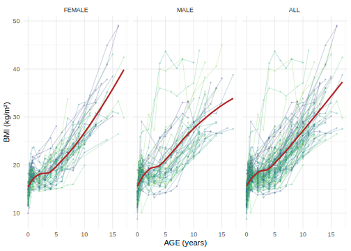
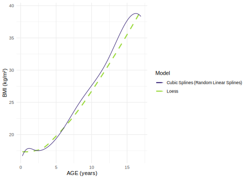
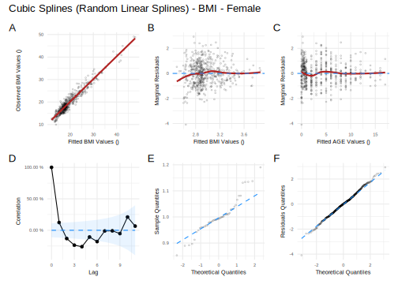
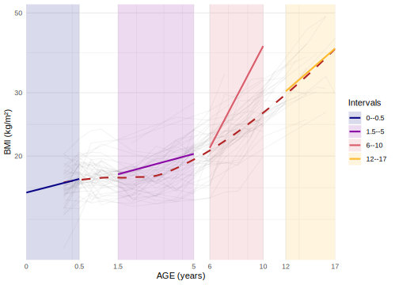
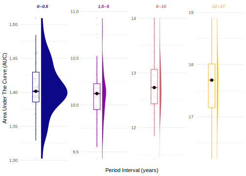

<!-- README.md is generated from README.Rmd. Please edit that file -->

# Early Growth Genetics Longitudinal Analysis 

<!-- badges: start -->

[](https://www.tidyverse.org/lifecycle/#experimental)
[](https://github.com/mcanouil/eggla)
[](https://github.com/mcanouil/eggla/actions)
<!-- badges: end -->

Tools for longitudinal analysis within the EGG (Early Growth Genetics)
Consortium.

------------------------------------------------------------------------

-   [Installation](#installation)
-   [Run The Cubic Splines (Random Linear Splines)
    Analysis](#run-the-cubic-splines-random-linear-splines-analysis)
    -   [Setup](#setup)
    -   [Data](#data)
    -   [Modelling female](#modelling-female)
    -   [Predicted values](#predicted-values)
    -   [Residuals](#residuals)
    -   [Predicted Average Slopes](#predicted-average-slopes)
    -   [Area Under The Curves](#area-under-the-curve)
-   [License](#license)
-   [Code of Conduct](#code-of-conduct)

------------------------------------------------------------------------

## Installation

-   Install the development version from GitHub:

``` r
# install.packages("remotes")
remotes::install_github("mcanouil/eggla")
```

-   Install a particular version:

``` r
# install.packages("remotes")
remotes::install_github("mcanouil/eggla@v0.3.0")
```

## Run The Cubic Splines (Random Linear Splines) Analysis

### Setup

``` r
# install.packages("remotes")
# remotes::install_github("mcanouil/eggla")
library(eggla)
# remotes::install_github("carriedaymont/growthcleanr@v2.0.0")
library(growthcleanr)
library(broom.mixed)
library(data.table)

# Setup for plots
library(ggplot2)
library(patchwork)
# remotes::install_github("eclarke/ggbeeswarm")
library(ggbeeswarm)
library(ggdist)
theme_set(theme_minimal())
options(
  ggplot2.discrete.colour = function(...) scale_colour_viridis_d(..., begin = 0.15, end = 0.85),
  ggplot2.discrete.fill = function(...) scale_fill_viridis_d(..., begin = 0.15, end = 0.85),
  ggplot2.continuous.colour = function(...) scale_colour_viridis_c(..., begin = 0.15, end = 0.85),
  ggplot2.continuous.fill = function(...) scale_fill_viridis_c(..., begin = 0.15, end = 0.85)
)
```

### Data

**eggla** includes a small dataset with 1050 rows and 6 variables.

-   `ID` (`character`): ID using three digits.

-   `age` (`numeric`): age in years.

-   `sex` (`integer`): sex with 1: male and 0: female.

-   `weight` (`numeric`): weight in kilograms.

-   `height` (`integer`): height in centimetres.

-   `bmi` (`numeric`): Body Mass Index in kilograms per quare metre.

    ``` r
    data("bmigrowth")
    bmigrowth <- as.data.table(bmigrowth)
    ```

    ``` r
    bmigrowth[bmigrowth[["ID"]] == "001"]
    #>     ID   age sex    weight height      bmi
    #> 1: 001  0.00   0  3.318845     47 15.02420
    #> 2: 001  0.25   0  6.585227     60 18.29230
    #> 3: 001  0.50   0  7.239751     64 17.67517
    #> 4: 001  0.75   0  9.474914     66 21.75141
    #> 5: 001  2.00   0 13.990333     79 22.41681
    #> 6: 001  4.00   0 25.909311    105 23.50051
    #> 7: 001  6.00   0 30.117745    106 26.80469
    #> 8: 001 12.00   0 77.958539    148 35.59101
    #> 9: 001 14.00   0 92.021767    156 37.81302
    ```

    ``` r
    ggplot(data = bmigrowth, mapping = aes(x = age, y = bmi, colour = factor(ID))) +
      geom_path(na.rm = TRUE, alpha = 0.25) +
      geom_point(size = 0.5, na.rm = TRUE, alpha = 0.25) +
      stat_smooth(method = "loess", formula = y ~ x, linetype = 1, colour = "firebrick", se = FALSE) +
      theme(legend.position = "none") +
      labs(x = "AGE (years)", y = "BMI (kg/m²)") +
      facet_grid(
        cols = vars(sex),
        margins = TRUE,
        labeller = labeller(
          .cols = function(x) c("0" = "FEMALE", "1" = "MALE", "2" = "FEMALE", "(all)" = "ALL")[x]
        )
      )
    ```

    

#### With Daymont’s QC

``` r
pheno_dt <- bmigrowth[
  j = `:=`(
    "agedays" = floor(age * 365.25), # convert to age in days and as integers ...
    "WEIGHTKG" = as.numeric(weight),
    "HEIGHTCM" = as.numeric(height)
  )
][
  j = `:=`(# recode sex with Male = 0 and Female = 1...
    "sex_daymont" = c("0" = "1", "1" = "0")[as.character(sex)]
  )
]

visits_long <- melt(
  data = pheno_dt,
  id.vars = c("ID", "age", "sex", "agedays", "sex_daymont"),
  measure.vars = c("WEIGHTKG", "HEIGHTCM"),
  variable.name = "param",
  value.name = "measurement"
)[
  j = clean := cleangrowth( # Daymont's QC from 'growthcleanr'
    subjid = ID,
    param = param,
    agedays = agedays,
    sex = sex_daymont,
    measurement = measurement,
    quietly = FALSE
  )
]
#> [2021-10-26 17:34:48] Begin processing pediatric data...
#> [2021-10-26 17:34:48] Calculating z-scores...
#> [2021-10-26 17:34:48] Calculating SD-scores...
#> [2021-10-26 17:34:48] Re-centering data...
#> [2021-10-26 17:34:48] Using NHANES reference medians...
#> [2021-10-26 17:34:48] Note: input data has at least one age-year with < 100 subjects...
#> [2021-10-26 17:34:48] Cleaning growth data in 1 batch(es)...
#> [2021-10-26 17:34:48] Processing Batch #1...
#> [2021-10-26 17:34:48] Preliminarily identify potential extraneous...
#> [2021-10-26 17:34:48] Identify potentially swapped measurements...
#> [2021-10-26 17:34:48] Exclude measurements carried forward...
#> [2021-10-26 17:34:48] Exclude extreme measurements based on SD...
#> [2021-10-26 17:34:48] Exclude extreme measurements based on EWMA...
#> [2021-10-26 17:34:49] Exclude extraneous based on EWMA...
#> [2021-10-26 17:34:49] Exclude moderate errors based on EWMA...
#> [2021-10-26 17:34:53] Exclude heights based on growth velocity...
#> [2021-10-26 17:34:55] Exclude single measurements and pairs...
#> [2021-10-26 17:34:55] Exclude all measurements if maximum threshold of errors is exceeded...
#> [2021-10-26 17:34:56] Completed Batch #1...
#> [2021-10-26 17:34:56] Done with pediatric data!
#> [2021-10-26 17:34:56] No adult data. Moving to postprocessing...
visits_clean <- dcast(
  data = visits_long[clean %in% "Include"], # Exclude all flags
  formula = ... ~ param,
  value.var = "measurement"
)[
  j = "bmi" := WEIGHTKG / (HEIGHTCM / 100)^2 # recompute bmi based using QCed variables
][
  !is.na(bmi) # exclude missing BMI related to measurements exclusion
]
```

#### Without Daymont’s QC

``` r
pheno_dt <- bmigrowth
```

### Modelling female

``` r
pheno_dt_female <- pheno_dt[sex_daymont == 1]
```

``` r
res <- egg_model(
  formula = log(bmi) ~ age, # covariates can be added after the term used for the time component, e.g., `log(bmi) ~ age + covariate`
  data = pheno_dt_female
)
#> nlme::lme(
#>   fixed = log(bmi) ~ gsp(age, knots = c(2, 8, 12), degree = rep(3, 4), smooth = rep(2, 3)),
#>   data = data,
#>   random = ~ gsp(age, knots = c(2, 8, 12), degree = rep(1, 4), smooth = rep(2, 3)) | ID,
#>   na.action = stats::na.omit,
#>   method = "ML",
#>   control = nlme::lmeControl(opt = "optim", maxIter = 500, msMaxIter = 500)
#> )
class(res)
#> [1] "lme"
sres <- tidy(res)
sres[["term"]] <- sub("gsp\\(.*\\)\\)", "gsp(...)", sres[["term"]]) # simplify output
sres
#> # A tibble: 11 x 8
#>    effect   group    term                     estimate std.error    df statistic   p.value
#>    <chr>    <chr>    <chr>                       <dbl>     <dbl> <dbl>     <dbl>     <dbl>
#>  1 fixed    fixed    (Intercept)                2.65     0.0148    478    179.    0       
#>  2 fixed    fixed    gsp(...)D1(0)              0.500    0.0306    478     16.3   5.41e-48
#>  3 fixed    fixed    gsp(...)D2(0)             -0.603    0.0404    478    -14.9   1.47e-41
#>  4 fixed    fixed    gsp(...)D3(0)              0.331    0.0225    478     14.7   1.39e-40
#>  5 fixed    fixed    gsp(...)C(2).3            -0.345    0.0238    478    -14.5   1.47e-39
#>  6 fixed    fixed    gsp(...)C(8).3             0.0239   0.00499   478      4.78  2.33e- 6
#>  7 fixed    fixed    gsp(...)C(12).3           -0.0278   0.0121    478     -2.30  2.21e- 2
#>  8 ran_pars ID       sd_(Intercept)             0.0727  NA          NA     NA    NA       
#>  9 ran_pars ID       cor_gsp(...).(Intercept)  -0.376   NA          NA     NA    NA       
#> 10 ran_pars ID       sd_gsp(...)                0.0170  NA          NA     NA    NA       
#> 11 ran_pars Residual sd_Observation             0.0834  NA          NA     NA    NA
```

### Predicted values

``` r
ggplot() +
  aes(x = age, y = bmi) +
  stat_smooth(
    data = pheno_dt_female,
    mapping = aes(colour = "Loess"),
    method = "loess", formula = y ~ x, linetype = 2, se = FALSE
  ) +
  geom_path(
    data = data.table(age = seq(min(pheno_dt_female[["age"]]), max(pheno_dt_female[["age"]]), 0.1))[
      j = bmi := exp(predict(res, .SD, level = 0)),
      .SDcols = "age"
    ],
    mapping = aes(colour = "Cubic Splines (Random Linear Splines)"),
  ) +
  labs(x = "AGE (years)", y = "BMI (kg/m²)", colour = "Model")
```



### Residuals

``` r
plot_residuals(
  x = "age",
  y = "log(bmi)",
  fit = res
) +
  plot_annotation(
    title = "Cubic Splines (Random Linear Splines) - BMI - Female",
    tag_levels = "A"
  )
```



### Predicted average slopes

``` r
res_pred_slopes <- egg_slopes(
  fit = res,
  period = c(0, 0.5, 1.5, 5, 6, 10, 12, 17)
)
head(res_pred_slopes)
#>    ID pred_period_0 pred_period_0.5 pred_period_1.5 pred_period_5 pred_period_6 pred_period_10 pred_period_12 pred_period_17 slope_0--0.5 slope_1.5--5 slope_6--10 slope_12--17
#> 1 082      2.778006        2.959951        3.037129      3.092756      3.174435       3.453177       3.563087       3.793297    0.3638897  0.015893264  0.06968560   0.04604207
#> 2 083      2.617273        2.801198        2.882337      2.951825      3.037464       3.332048       3.449879       3.699892    0.3678502  0.019853743  0.07364608   0.05000255
#> 3 080      2.634690        2.820459        2.905287      2.987686      3.077014       3.386354       3.511562       3.780019    0.3715390  0.023542526  0.07733486   0.05369133
#> 4 031      2.540167        2.719237        2.790665      2.826167      2.902096       3.157839       3.256249       3.457710    0.3581398  0.010143374  0.06393571   0.04029218
#> 5 007      2.638875        2.842205        2.962154      3.167477      3.291927       3.741751       3.937202       4.381265    0.4066602  0.058663771  0.11245611   0.08881258
#> 6 033      2.630668        2.807273        2.873772      2.892021      2.963021       3.199046       3.287597       3.464411    0.3532104  0.005213961  0.05900630   0.03536277
```

``` r
wrap_plots(
  ggplot(
    data = melt(
      data = setDT(res_pred_slopes),
      id.vars = c("ID"),
      measure.vars = patterns("^slope_"),
      variable.name = "period_interval",
      value.name = "slope"
    )[
      j = period_interval := factor(
        x = gsub("slope_", "", period_interval),
        levels = gsub("slope_", "", unique(period_interval))
      )
    ]
  ) +
    aes(x = slope, y = period_interval) +
    stat_halfeye(
      mapping = aes(fill = period_interval),
      justification = -0.30,
      .width = 0,
      scale = 0.5
    ) +
    geom_boxplot(mapping = aes(colour = period_interval), width = 0.25, outlier.colour = NA) +
    geom_quasirandom(
      mapping = aes(fill = period_interval, colour = period_interval),
      # colour = "white",
      shape = 21,
      alpha = 0.25,
      groupOnX = FALSE,
      width = 0.15#,
      # side = -1,
      # cex = 0.5
    ) +
    labs(x = "Predicted Slope", y = "Period Interval (years)") +
    theme(legend.position = "none"),
  ggplot(
    data = melt(
      data = setDT(res_pred_slopes),
      id.vars = c("ID"),
      measure.vars = patterns("^pred_period_"),
      variable.name = "period",
      value.name = "pred"
    )[
      j = period := as.numeric(gsub("pred_period_", "", period))
    ]
  ) +
    aes(x = period, y = pred, colour = factor(ID)) +
    geom_path() +
    labs(x = "Age (years)", y = "Predicted Values") +
    theme(legend.position = "none"),
    ncol = 2
) +
  plot_annotation(tag_levels = "A")
```



### Area under the curve

``` r
res_auc <- egg_auc(
  fit = res,
  period = c(0, 0.5, 1.5, 5, 6, 10, 12, 17)
)
head(res_auc)
#>    ID auc_0--0.5 auc_1.5--5 auc_6--10 auc_12--17
#> 1 082   1.439909  10.587170  13.32182   18.63462
#> 2 083   1.360037  10.069653  12.80563   18.11809
#> 3 080   1.369207  10.172574  12.99334   18.47262
#> 4 031   1.320271   9.689328  12.18647   17.02856
#> 5 007   1.375690  10.586726  14.13396   21.03983
#> 6 033   1.364905   9.950009  12.39073   17.12369
```

``` r
ggplot(
  data = melt(
    data = setDT(res_auc),
    id.vars = c("ID"),
    measure.vars = patterns("^auc_"),
    variable.name = "period_interval",
    value.name = "auc"
  )[
    j = period_interval := factor(
      x = gsub("auc_", "", period_interval),
      levels = gsub("auc_", "", unique(period_interval))
    )
  ]
) +
  aes(x = auc, y = period_interval) +
  stat_halfeye(
    mapping = aes(fill = period_interval),
    justification = -0.20,
    .width = 0,
    scale = 1
  ) +
  geom_boxplot(mapping = aes(colour = period_interval), width = 0.25, outlier.colour = NA) +
  geom_quasirandom(
    mapping = aes(fill = period_interval, colour = period_interval),
    # colour = "white",
    shape = 21,
    alpha = 0.25,
    groupOnX = FALSE,
    width = 0.15#,
    # side = -1,
    # cex = 0.5
  ) +
  labs(x = "Area Under The Curve (AUC)", y = "Period Interval (years)") +
  theme(legend.position = "none")
```



## License

MIT © [Mickaël Canouil](https://github.com/mcanouil), Nicole Warrington

## Code of Conduct

Please note that the `eggla` project is released with a [Contributor
Code of
Conduct](https://contributor-covenant.org/version/2/0/CODE_OF_CONDUCT.html).  
By contributing to this project, you agree to abide by its terms.
