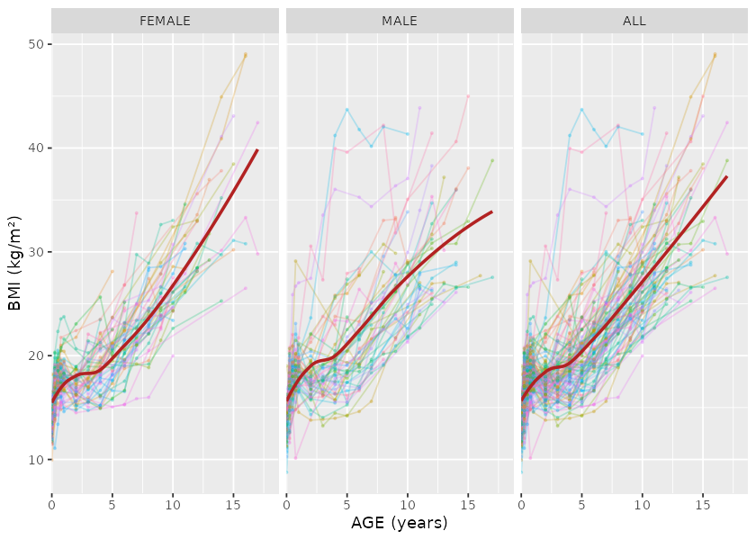
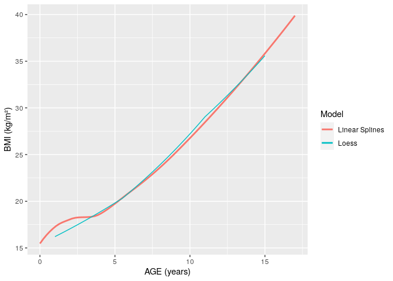
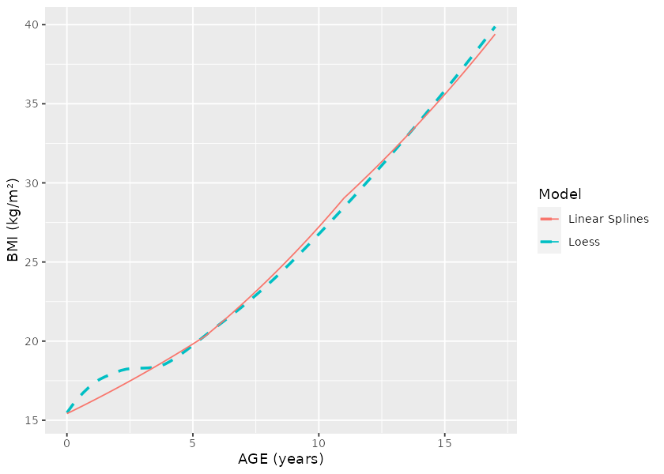
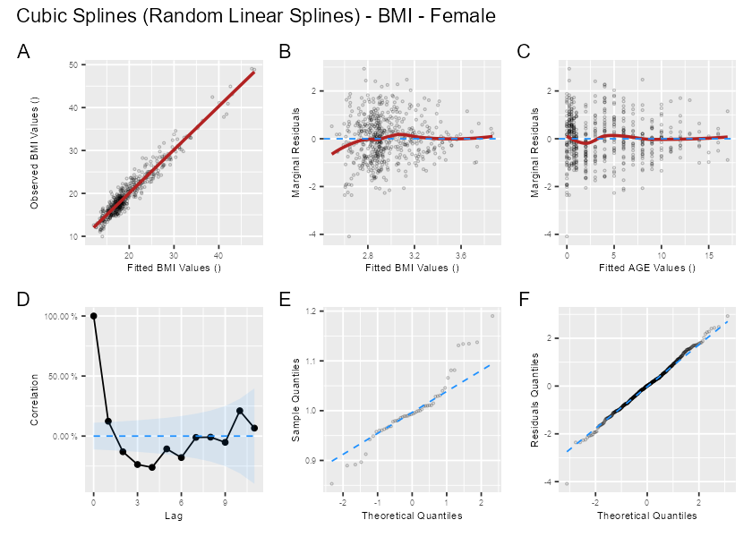
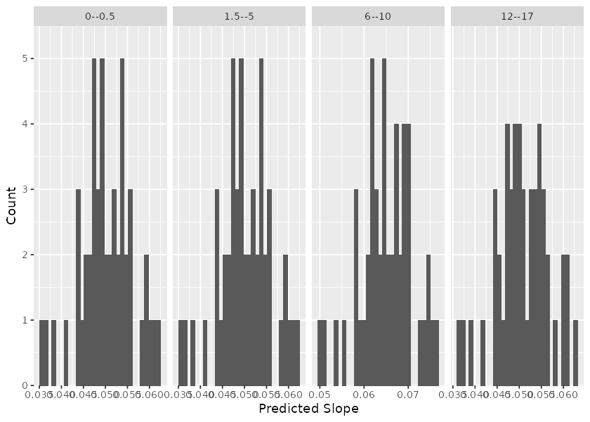

<!-- README.md is generated from README.Rmd. Please edit that file -->

# Early Growth Genetics Longitudinal Analysis 

<!-- badges: start -->

[](https://www.tidyverse.org/lifecycle/#experimental)
[](https://CRAN.R-project.org/package=eggla)
[](https://github.com/mcanouil/eggla/actions)
<!-- badges: end -->

Tools for longitudinal analysis within the EGG (Early Growth Genetics)
Consortium.

## Installation

``` r
# Install insane from CRAN:
install.packages("eggla")

# Or the the development version from GitHub:
# install.packages("remotes")
remotes::install_github("mcanouil/eggla")
```

## Hands on **eggla**

``` r
library(eggla)
library(data.table)
library(ggplot2)
library(patchwork)
library(broom.mixed)
#> Registered S3 method overwritten by 'broom.mixed':
#>   method      from 
#>   tidy.gamlss broom
```

### Data

**eggla** includes a small dataset with 1050 rows and 6 variables.

  - `ID` (`character`): ID using three digits.
  - `age` (`numeric`): age in years.
  - `sex` (`integer`): sex with 1: male and 0: female.
  - `weight` (`numeric`): weight in kilograms.
  - `height` (`integer`): height in centimetres.
  - `bmi` (`numeric`): Body Mass Index in kilograms per quare metre.

<!-- end list -->

``` r
data("bmigrowth")
bmigrowth[bmigrowth[["ID"]] == "001", ]
#>       ID   age sex    weight height      bmi
#> 1020 001  0.00   0  3.318845     47 15.02420
#> 1021 001  0.25   0  6.585227     60 18.29230
#> 1022 001  0.50   0  7.239751     64 17.67517
#> 1023 001  0.75   0  9.474914     66 21.75141
#> 1024 001  2.00   0 13.990333     79 22.41681
#> 1025 001  4.00   0 25.909311    105 23.50051
#> 1026 001  6.00   0 30.117745    106 26.80469
#> 1027 001 12.00   0 77.958539    148 35.59101
#> 1028 001 14.00   0 92.021767    156 37.81302
```

``` r
ggplot(data = bmigrowth, mapping = aes(x = age, y = bmi, colour = factor(ID))) +
  geom_path(na.rm = TRUE, alpha = 0.25) +
  geom_point(size = 0.5, na.rm = TRUE, alpha = 0.25) +
  stat_smooth(method = "loess", formula = y ~ x, linetype = 1, colour = "firebrick", se = FALSE) +
  theme(legend.position = "none") +
  labs(x = "AGE (years)", y = "BMI (kg/m²)") +
  facet_grid(
    cols = vars(sex), 
    margins = TRUE, 
    labeller = labeller(
      .cols = function(x) c("0" = "FEMALE", "1" = "MALE", "2" = "FEMALE", "(all)" = "ALL")[x]
    )
  )
```



### Modelling

**eggla** includes three models, namely `cubic_slope`, `linear_splines`
and `cubic_splines`, all implemented with the R package `nlme`.

  - `x` and `y`, the variables as character with possible
    transformation.

  - `data`, the data in which the variables are.

  - `method`, the method or model to be performed.

  - `knots`, the knots for “splines” methods. Default is the following:
    
    ``` r
    knots = list(
      "cubic_slope" = NULL,
      "linear_splines" = c(5.5, 11),
      "cubic_splines" = c(2, 8, 12)
    )[[method]]
    ```

<!-- end list -->

``` r
ls_mod <- time_model(
  x = "age", 
  y = "log(bmi)", 
  data = bmigrowth[bmigrowth$sex == 0, ], 
  method = "linear_splines"
)
```

The results of `time_model` is an `lme` object, on which any usual
methods can be applied, *e.g.*, `summary()` or `coefficients()`.

``` r
class(ls_mod)
#> [1] "lme"
tidy(ls_mod)
#> # A tibble: 15 x 8
#>    effect  group  term              estimate std.error    df statistic   p.value
#>    <chr>   <chr>  <chr>                <dbl>     <dbl> <dbl>     <dbl>     <dbl>
#>  1 fixed   fixed  (Intercept)        2.74e+0   0.0143    481    191.    0.      
#>  2 fixed   fixed  gsp(age, knots =…  5.02e-2   0.00447   481     11.2   3.38e-26
#>  3 fixed   fixed  gsp(age, knots =…  1.47e-2   0.00823   481      1.78  7.55e- 2
#>  4 fixed   fixed  gsp(age, knots =… -1.41e-2   0.0124    481     -1.13  2.59e- 1
#>  5 ran_pa… ID     sd_(Intercept)     3.22e-4  NA          NA     NA    NA       
#>  6 ran_pa… ID     cor_gsp(age, kno… -5.33e-1  NA          NA     NA    NA       
#>  7 ran_pa… ID     cor_gsp(age, kno…  8.19e-3  NA          NA     NA    NA       
#>  8 ran_pa… ID     cor_gsp(age, kno…  1.77e-3  NA          NA     NA    NA       
#>  9 ran_pa… ID     sd_gsp(age, knot…  9.14e-3  NA          NA     NA    NA       
#> 10 ran_pa… ID     cor_gsp(age, kno… -5.39e-2  NA          NA     NA    NA       
#> 11 ran_pa… ID     cor_gsp(age, kno… -5.46e-3  NA          NA     NA    NA       
#> 12 ran_pa… ID     sd_gsp(age, knot…  7.24e-4  NA          NA     NA    NA       
#> 13 ran_pa… ID     cor_gsp(age, kno… -1.37e-2  NA          NA     NA    NA       
#> 14 ran_pa… ID     sd_gsp(age, knot…  5.35e-4  NA          NA     NA    NA       
#> 15 ran_pa… Resid… sd_Observation     1.29e-1  NA          NA     NA    NA
```

``` r
ggplot() +
  aes(x = age, y = bmi) +
  stat_smooth(
    data = bmigrowth[bmigrowth$sex == 0, ], 
    mapping = aes(colour = "Loess"),
    method = "loess", formula = y ~ x, linetype = 2, se = FALSE
  ) +
  geom_path(
    data = data.table(age = seq(1, 15, 0.1))[, 
      bmi := exp(predict(ls_mod, .SD, level = 0)), 
      .SDcols = "age"
    ],
    mapping = aes(colour = "Linear Splines"),
  ) +
  labs(x = "AGE (years)", y = "BMI (kg/m²)", colour = "Model")
```



### Residuals

Different plot are available for model diagnostic, using the residuals
mostly.

``` r
plot_residuals(
  x = "age", 
  y = "log(bmi)", 
  fit = ls_mod, 
  variables_unit = list(age = "years", bmi = "kg/m²")
) + 
  plot_annotation(
    title = "LINEAR SPLINES - BMI - Female", 
    tag_levels = "A"
  )
```



### Predicted Average Slopes

``` r
ls_pred_slopes <- predict_average_slopes(
  fit = ls_mod,
  method = "linear_splines",
  period = c(0, 0.5, 1.5, 5, 6, 10, 12, 17)#,
  # knots = list(
  #   "cubic_slope" = NULL,
  #   "linear_splines" = c(5.5, 11),
  #   "cubic_splines" = c(2, 8, 12)
  # )[[method]]
)
head(ls_pred_slopes)
#>    ID pred_period_0 pred_period_0.5 pred_period_1.5 pred_period_5 pred_period_6
#> 1 082      2.735439        2.762511        2.816655      3.006160      3.067621
#> 2 083      2.735490        2.761140        2.812441      2.991992      3.050623
#> 3 080      2.735416        2.763044        2.818299      3.011694      3.074279
#> 4 031      2.735635        2.757395        2.800915      2.953235      3.004088
#> 5 007      2.735343        2.764931        2.824107      3.031223      3.097708
#> 6 033      2.735522        2.760322        2.809922      2.983523      3.040459
#>   pred_period_10 pred_period_12 pred_period_17 slope_0--0.5 slope_1.5--5
#> 1       3.342735       3.466240       3.739871   0.05414430   0.05414430
#> 2       3.314462       3.432331       3.691878   0.05130055   0.05130055
#> 3       3.353938       3.479719       3.759049   0.05525556   0.05525556
#> 4       3.236837       3.339155       3.559810   0.04351995   0.04351995
#> 5       3.392892       3.526430       3.825145   0.05917600   0.05917600
#> 6       3.297546       3.412039       3.663148   0.04960030   0.04960030
#>   slope_6--10 slope_12--17
#> 1  0.06877847   0.05472615
#> 2  0.06595982   0.05190939
#> 3  0.06991477   0.05586604
#> 4  0.05818719   0.04413098
#> 5  0.07379578   0.05974289
#> 6  0.06427164   0.05022171
```

``` r
ggplot(
  data = melt(
    data = setDT(ls_pred_slopes), 
    id.vars = c("ID"), 
    measure.vars = patterns("^slope_"),
    variable.name = "period_interval", 
    value.name = "slope"
  )[, 
    period_interval := factor(
      x = gsub("slope_", "", period_interval), 
      levels = gsub("slope_", "", unique(period_interval))
    )
  ]
) +
  aes(x = slope) +
  geom_histogram(bins = 30) +
  scale_y_continuous(expand = expansion(c(0, 0.1))) +
  facet_grid(cols = vars(period_interval), scales = "free") +
  labs(x = "Predicted Slope", y = "Count")
```



### Area Under The Curves

``` r
ls_auc <- compute_auc(
  fit = ls_mod,
  method = "linear_splines",
  period = c(0, 0.5, 1.5, 5, 6, 10, 12, 17)#,
  # knots = list(
  #   "cubic_slope" = NULL,
  #   "linear_splines" = c(5.5, 11),
  #   "cubic_splines" = c(2, 8, 12)
  # )[[method]]
)
head(ls_auc)
#>    ID auc_0--0.5 auc_1.5--5 auc_6--10 auc_12--17
#> 1 082   1.374487   10.18993  12.82071   18.01528
#> 2 083   1.374157   10.15776  12.73017   17.81052
#> 3 080   1.374615   10.20249  12.85643   18.09692
#> 4 031   1.373257   10.06976  12.48185   17.24741
#> 5 007   1.375068   10.24683  12.98120   18.37894
#> 6 033   1.373961   10.13853  12.67601   17.68797
```

``` r
ggplot(
  data = melt(
    data = setDT(ls_auc), 
    id.vars = "ID", 
    measure.vars = patterns("^auc_"),
    variable.name = "period_interval", 
    value.name = "auc"
  )[, 
    period_interval := factor(
      x = gsub("auc_", "", period_interval), 
      levels = gsub("auc_", "", unique(period_interval))
    )
  ]
) +
  aes(x = auc) +
  geom_histogram(bins = 30) +
  scale_y_continuous(expand = expansion(c(0, 0.1))) +
  facet_grid(cols = vars(period_interval), scales = "free") +
  labs(x = "Area Under The Curve (AUC)", y = "Count")
```



### Render Analyses As Rmarkdown

``` r
library(eggla)
data("bmigrowth")

file.copy(
  from = system.file("rmarkdown", "templates", "eggla", "skeleton", "skeleton.Rmd", package = "eggla"),
  to = file.path(tempdir(), "eggla.Rmd"),
  overwrite = TRUE
)

rmarkdown::render(
  input = file.path(tempdir(), "eggla.Rmd"),
  params = list(
    cohort_name =  "BMI Growth (Demo)",
    phenotypes = bmigrowth,
    trait = "bmi",
    output_directory = tempdir()
  )
)

file.copy(file.path(tempdir(), "eggla.html"), "eggla.html")
```

<!-- ```{r, eval = FALSE} -->

<!-- run_eggla( -->

<!--   phenotypes = bmigrowth, -->

<!--   trait = "bmi", -->

<!--   cohort_name = "cohort", -->

<!--   output_directory = tempdir() -->

<!-- ) -->

<!-- ``` -->
